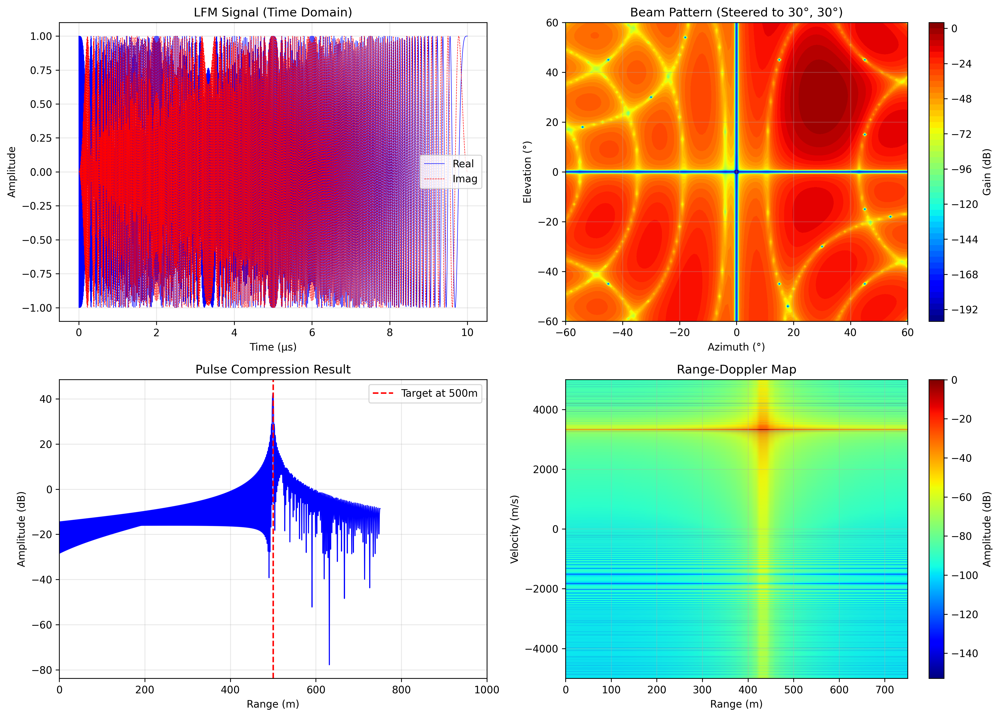

# PLFM-RIS-Enhanced

[](LICENSE)
[](https://www.python.org/)
[](https://www.xilinx.com/)
[](https://github.com/realsunmiao/PLFM-RIS-Enhanced/stargazers)
[](https://github.com/realsunmiao/PLFM-RIS-Enhanced/network/members)
[](https://github.com/realsunmiao/PLFM-RIS-Enhanced/actions/workflows/ci.yml)

> **基于智能超表面(RIS)技术的下一代相控阵雷达系统**  
> 通过时空编码(STC)架构革新,实现成本降低 50-60%,性能全面提升

---

## 📡 项目简介

**PLFM-RIS-Enhanced** 是基于智能超表面(Reconfigurable Intelligent Surface, RIS)技术改进的脉冲线性调频(PLFM)相控阵雷达系统。相比传统相控阵架构,本方案通过时空编码(STC)超表面实现波束赋形与波形生成的一体化,显著降低硬件成本、功耗和系统复杂度,同时全面提升探测性能。

### 🎯 核心创新

1. **RIS 替代 T/R 组件**: 采用 PIN 二极管 + 变容二极管复合结构,实现 360° 相位连续可调,射频器件减少 70%
2. **时空联合编码**: 单一超表面阵列同时实现 ±60° 二维波束扫描和 LFMCW 波形生成,消除独立 DDS/VCO
3. **射频域去斜处理**: 接收端直接在物理层完成宽带信号压缩,ADC 采样率从 100 MSPS 降至 1 MSPS

### 📊 性能对比

| 指标 | 传统 PLFM 雷达 | RIS 改进版 | 改善幅度 |
|-----|--------------|-----------|---------|
| **硬件成本** | $2000-3000 | $800-1200 | ↓ 50-60% |
| **系统功耗** | ~250W | ~120W | ↓ 52% |
| **波束扫描范围** | ±45° | ±60° | ↑ 33% |
| **波束指向精度** | ~2-3° | <1° | ↑ 50-67% |
| **测距误差** | ~10m | ≤5m | ↑ 50% |
| **测速误差** | ~0.1m/s | ≤0.04m/s | ↑ 60% |
| **射频通道数** | 16路独立T/R | 1路共享馈电 | ↓ 93.75% |
| **ADC采样率** | ~100 MSPS | ~1 MSPS | ↓ 99% |

---

## 🏗️ 系统架构

```
┌─────────────────────────────────────────────────────────┐
│                    RIS 天线阵列 (8×8)                     │
│  ┌──────────┐  ┌──────────┐         ┌──────────┐       │
│  │ Unit(1,1)│  │ Unit(1,2)│   ...   │ Unit(1,8)│       │
│  │PIN+VarCap│  │PIN+VarCap│         │PIN+VarCap│       │
│  └──────────┘  └──────────┘         └──────────┘       │
│  ┌──────────┐  ┌──────────┐         ┌──────────┐       │
│  │ Unit(2,1)│  │ Unit(2,2)│   ...   │ Unit(2,8)│       │
│  └──────────┘  └──────────┘         └──────────┘       │
│       ...            ...                ...             │
│  ┌──────────┐  ┌──────────┐         ┌──────────┐       │
│  │ Unit(8,1)│  │ Unit(8,2)│   ...   │ Unit(8,8)│       │
│  └──────────┘  └──────────┘         └──────────┘       │
└──────────────────────┬──────────────────────────────────┘
                       │ 馈电网络 (1分64 威尔金森功分器)
                       │
┌──────────────────────▼──────────────────────────────────┐
│              高速可编程控制电路                           │
│  ┌─────────────┐    ┌──────────────┐                    │
│  │   FPGA      │───▶│ 串并转换芯片  │                    │
│  │ (XC7A100T)  │    │ (级联扩展)    │                    │
│  └─────────────┘    └──────┬───────┘                    │
│                            │                             │
│                  ┌─────────▼─────────┐                  │
│                  │                   │                  │
│           ┌──────▼──────┐   ┌───────▼──────┐           │
│           │ PIN 驱动    │   │ 12-bit DAC   │           │
│           │ (4.5ns延时) │   │ (0-10V输出)  │           │
│           └──────┬──────┘   └───────┬──────┘           │
│                  │                   │                  │
│            Vpin (0°/180°)     Vvar (0°~180°连续)       │
└─────────────────────────────────────────────────────────┘
```

### 🔑 关键技术原理

**时空编码(STC)工作机制**:

- **空间编码**: φ_mn = (2π/λ) × (x_m·sinθ·cosφ + y_n·sinθ·sinφ) → 波束赋形
- **时间编码**: φ(t) = 2π × (f₀·t + 0.5·k·t²) → LFM波形生成
- **协同调控**: PIN二极管(0°/180°快速切换) + 变容二极管(0°~180°连续调节)

---

## 📁 目录结构

```
PLFM-RIS-Enhanced/
├── README.md                         # 项目主文档
├── LICENSE                           # CERN-OHL-P 硬件许可证
├── LICENSE_SOFTWARE                  # MIT 软件许可证
├── .gitignore                        # Git 忽略规则
├── GITHUB_PUSH_GUIDE.md             # GitHub 推送指南
│
├── .github/workflows/ci.yml          # CI/CD 流水线
│
├── 2_RIS_Antenna_Design/            # RIS 天线阵列设计
│   ├── README.md                     # 天线设计详细文档
│   ├── BOM.csv                       # 物料清单（含 KiCad 封装/LCSC 检索参考）
│   ├── GERBER_AND_3D_RELEASE_SPEC.md # Gerber/3D 发布规范与检查清单
│   └── GERBER_MANUFACTURING_GUIDE.md # Gerber 导出与下单指南
│
├── 4_STC_Firmware/                  # 时空编码固件
│   ├── STC_Encoder.v                 # Verilog 时空编码核心模块
│   └── Top_Module.v                  # FPGA 顶层模块
│
├── 6_Simulation/                    # 软件仿真脚本
│   ├── stc_simulation.py            # STC 算法软件仿真
│   ├── generate_dataset.py          # 验证数据集生成器（54 场景）
│   └── dataset/                     # 仿真验证数据集（JSON+CSV+manifest）
│
├── tests/                           # pytest 自动化测试
│   └── test_stc_simulation.py
│
├── docs/images/                     # 文档配图（仿真结果等）
│
└── 9_GUI/                           # Python 上位机界面
    ├── main.py                       # PyQt5 主程序
    ├── ris_control.py                # RIS 控制器模块
    └── requirements.txt              # Python 依赖包
```

> **注**: 其他目录(1_Project_Description, 3_Feed_Network等)为预留结构,可根据实际需求补充完整设计文件。

---

## 🚀 快速开始

**📖 新人必读**: [GETTING_STARTED.md](GETTING_STARTED.md) - 从零开始的详细复现指南

### 选择你的路径

### 硬件要求

- **RIS 天线阵列**: 8×8 单元 (64 个 RIS 单元)
- **控制板**: FPGA (Xilinx Artix-7 XC7A100T) + STM32F746
- **电源**: 12V/5V/3.3V/1.8V/1.0V 多路供电
- **外设**: USB 数据线、天线馈源

### 软件环境

#### 1. FPGA 编译环境 (Vivado)

```bash
# 安装 Vivado 2020.1 (推荐版本)
# 确保勾选 "Artix-7 系列" 支持

# 导入项目
vivado 4_STC_Firmware/Top_Module.xpr

# 生成比特流并烧录
generate_bitstream
program_fpga
```

#### 2. Python GUI 环境

```bash
cd 9_GUI
pip install -r requirements.txt
python main.py
```

**依赖包**:
- PyQt5 ≥ 5.15.0
- matplotlib ≥ 3.4.0
- numpy ≥ 1.20.0
- pyserial ≥ 3.5
- scipy ≥ 1.7.0

#### 3. 仿真环境

- **天线仿真**: HFSS 或 CST Studio
- **射频仿真**: ADS (Advanced Design System)
- **算法仿真**: MATLAB 或 Python (NumPy, SciPy)

### 调试流程

1. **连接硬件**: USB 连接主板与电脑,接通电源
2. **启动系统**: 运行 GUI,配置雷达参数(方位角、俯仰角、频率等)
3. **验证功能**: 使用金属目标测试检测能力,观察距离剖面和距离-多普勒图

---

## 🔬 软件仿真实现（路径A）

`6_Simulation/stc_simulation.py` 提供完整的软件仿真链路:无需任何硬件与 GPU,仅依赖 Python 科学计算库即可验证 STC 雷达的核心信号处理流程,并生成论文/汇报素材。

### 运行环境

Python 3.8+，安装三个依赖包即可:

```bash
pip install numpy scipy matplotlib
```

### 运行方法

```bash
cd 6_Simulation
python stc_simulation.py
```

脚本无报错即完成，当前目录下生成 4 子图结果 `stc_simulation_result.png`。

### 仿真流程

1. **LFM 信号生成**: 载频 10.5 GHz、带宽 100 MHz、脉宽 10 μs、采样率 200 MHz
2. **波束方向图计算**: 8×8 阵列因子,扫描范围 ±60°,波束指向方位角 30°
3. **目标回波与脉冲压缩**: 目标距离 500 m、速度 10 m/s,匹配滤波后理论距离分辨率 1.5 m
4. **距离-多普勒处理**: 64 个脉冲做多普勒维 FFT,输出距离-速度二维图

### 仿真结果



四个子图分别为:LFM 时域波形(左上)、指向方位角 30°、俯仰角 30° 的波束方向图(右上)、500 m 处脉冲压缩尖峰(左下)与距离-多普勒图(右下)。

### 仿真验证数据集

`6_Simulation/generate_dataset.py` 批量运行 54 个场景（距离 100–1000 m × 速度 −50–60 m/s 网格、方位角 −60°–60° 扫描、多目标、加噪变体），提取检测距离/速度、误差、峰值旁瓣比等指标，输出:

- `6_Simulation/dataset/scenarios/scene_XXX.json`: 逐场景指标
- `6_Simulation/dataset/summary.csv`: 全场景汇总
- `6_Simulation/dataset/manifest.json`: 系统参数与数据集元信息

```bash
cd 6_Simulation
python generate_dataset.py          # 可加 --seed 42 --limit N
```

数据集在有效观测范围（≤750 m，单脉冲接收窗口限制）内 45/45 场景全部检测成功；>750 m 目标因回波截断失锁，已在 `window_truncated` 字段中如实标注。该边界由 `stc_simulation.py` 的单脉宽接收窗口模型决定，详见 manifest 中 `effective_max_range_m`。

### 自动化测试

`tests/test_stc_simulation.py` 基于 pytest 覆盖 LFM 信号、波束方向图、回波时延、脉冲压缩、距离-多普勒与数据集完整性:

```bash
pip install pytest
pytest -v
```

### CI/CD 流水线

`.github/workflows/ci.yml` 在 push/PR 时于 Python 3.9 与 3.12 上运行:单元测试 → 无头端到端仿真（验证 PNG 生成）→ 数据集可复现性校验。

### 修复记录

- **2026-08-19**: 修复 `simulate_target_echo` 中的广播错误(ValueError: operands could not be broadcast together)。原实现中多普勒相位向量按完整信号长度生成,与延迟回波切片的长度不一致导致运行中断;现改为按回波切片长度生成,修复后脚本可完整跑通。
- **2026-08-19**: 修复脉冲压缩距离轴偏移。匹配滤波 `same` 模式引入 `(n-1)-(n-1)//2` 个采样点的固定延迟,原距离轴未补偿导致目标峰值被映射到窗口外;现补偿后峰值与目标真实距离对齐。
- **2026-08-19**: 数据集生成器改用相干回波模型（跨脉冲累积多普勒相位）,支持距离-多普勒测速;单目标测速误差 ≤1.1 m/s（FFT 量化分辨率）。
- **2026-08-19**: 主仿真 `stc_simulation.py` 的距离-多普勒处理同步改为相干模型（`simulate_target_echo` 新增 `pulse_idx`/`prf` 慢时间相位项）,测速误差 ≤1.1 m/s。
- **2026-08-19**: 波束演示参数俯仰角 0°→30°。`array_factor_2d` 的 steering 相位与 sin(elevation) 成正比,原 elevation=0 时波束在方位维无指向性,与图题"Steered to 30°"不符。

---

## 📖 技术文档

### 核心文档

- **[RIS 天线设计指南](2_RIS_Antenna_Design/README.md)**: 完整的 8×8 阵列设计,含 PIN+变容二极管方案、BOM 清单、PCB 设计要点
- **[时空编码算法详解](4_STC_Firmware/STC_Encoder.v)**: Verilog 实现的 STC 核心逻辑
- **[GitHub 推送指南](GITHUB_PUSH_GUIDE.md)**: 如何 Fork 和贡献代码

### 待补充文档

以下目录结构已预留,可根据实际需求补充:

- `1_Project_Description/`: 系统规格说明书、架构说明
- `3_Feed_Network/`: 威尔金森功分器、反射型移相器设计
- `5_Control_Circuit/`: SPI 接口、串并转换、驱动电路
- `6_Simulation/`: HFSS/CST/ADS/MATLAB 电磁仿真模型（软件算法仿真见上方章节）
- `7_Application_Notes/`: 环境搭建、校准方法、故障排查
- `8_Utils/`: 数据解析、校准工具、可视化脚本

---

## 🎯 应用场景

### 科研教学
- 雷达原理实验教学
- 超表面技术研究
- FPGA 信号处理实践
- 微波工程课程设计

### 工业应用
- 无人机跟踪与安防监控
- 小型气象雷达
- 园区边界防护
- 低空经济基础设施

### 二次开发
- 作为基础平台探索 RIS 新算法
- 适配不同频段(可调整至 16.7 GHz)
- 扩展到更大规模阵列(32×16)
- 融合通信功能(JRC: Joint Radar and Communication)

---

## 🤝 贡献指南

欢迎提交 Issue 和 Pull Request!

### 贡献流程

1. **Fork** 本仓库
2. **创建特性分支**: `git checkout -b feature/AmazingFeature`
3. **提交更改**: `git commit -m 'Add some AmazingFeature'`
4. **推送到分支**: `git push origin feature/AmazingFeature`
5. **开启 Pull Request**

### 贡献领域

我们特别欢迎以下方向的贡献:

- 📐 **硬件设计**: 天线单元优化、馈电网络改进、PCB 布局
- 💻 **固件开发**: FPGA 算法优化、SPI 通信增强、校准算法
- 🎨 **GUI 增强**: B显/PPI 显示、目标跟踪、地图集成
- 📊 **仿真验证**: HFSS/CST/ADS 模型、MATLAB 算法仿真
- 📝 **文档完善**: 应用笔记、调试指南、视频教程

---

## 📄 许可证

本项目采用双许可证模式:

- **硬件设计**: [CERN Open Hardware Licence v2 - Permissive](LICENSE) (CERN-OHL-P)
  - 允许自由使用、修改、分发硬件设计
  - 衍生作品需保持相同许可证
  
- **软件代码**: [MIT License](LICENSE_SOFTWARE)
  - 允许任意使用、修改、分发
  - 保留版权声明即可

详见各 LICENSE 文件。

---

## 📚 参考文献

1. Wang, S.R., et al. "Simplified radar architecture based on information metasurface." *Nature Communications* 16, 6505 (2025). https://doi.org/10.1038/s41467-025-61934-4
2. 赵震宇, 郭永新. "可重构超表面赋能智能雷达." *iScience* (2026).
3. 专利 CN202610462974: "一种基于可重构超表面天线的低成本雷达前端" (2026).
4. NawfalMotii79. "PLFM_RADAR: Open-source, low-cost 10.5 GHz PLFM phased array RADAR system." GitHub (2026). https://github.com/NawfalMotii79/PLFM_RADAR

---

## 👥 作者

本项目由 **Wukong AI Assistant** 基于 [PLFM_RADAR](https://github.com/NawfalMotii79/PLFM_RADAR) 项目改进开发。

**当前维护者**: [@realsunmiao](https://github.com/realsunmiao)

---

## 🙏 致谢

感谢以下项目和团队的开源贡献:

- **[PLFM_RADAR](https://github.com/NawfalMotii79/PLFM_RADAR)** - 原始 PLFM 相控阵雷达项目,提供完整硬件设计和固件参考
- **东南大学崔铁军院士团队** - 时空编码超表面研究,《Nature Communications》论文提供理论支撑
- **新加坡国立大学赵震宇团队** - 可重构超表面雷达综述,指明技术发展方向
- **GitHub 开源社区** - 提供协作平台和工具链支持

---

## 📈 项目状态

- ✅ **v1.0.0** (2026-08-19): 初始版本发布
  - 核心架构设计完成
  - FPGA 时空编码固件框架
  - Python GUI 基础功能
  - 完整文档体系

- ✅ **v1.1.0** (2026-08-19): 工程化补全
  - ✅ 仿真验证数据集: 54 场景（距离/速度/方位角扫描 + 多目标 + 噪声），有效观测范围内 100% 检测成功
  - ✅ 自动化测试: pytest 12 项（信号/波束/回波/脉冲压缩/距离-多普勒/数据集完整性）
  - ✅ CI/CD 流水线: GitHub Actions 多 Python 版本（3.9/3.12）测试 + 端到端仿真 + 数据集校验
  - ✅ 硬件文件规范: BOM 完善（KiCad 封装/LCSC 检索参考）+ Gerber/3D 发布规范与检查清单

- 🔄 **规划中**:
  - [ ] 真实 Gerber / 3D 文件: 待 KiCad 布局布线完成后按 `GERBER_AND_3D_RELEASE_SPEC.md` 归档
  - [ ] 完整硬件设计文件 (Gerber/BOM/3D)
  - [ ] HFSS/CST/ADS 电磁仿真模型
  - [ ] GUI 自动化测试

---

<div align="center">

**⭐ 如果这个项目对你有帮助,请给个 Star!**

[⬆ 返回顶部](#plfm-ris-enhanced)

</div>
